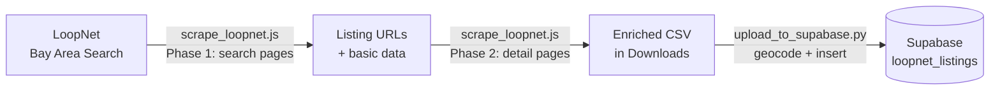

# loopnet-bot

Scrapes Bay Area multifamily listings from LoopNet and uploads them to the Supabase `loopnet_listings` table. Each run is stored as a historical snapshot so price changes and market activity can be tracked over time.

---

## Pipeline Overview



---

## Step 1 — Scrape LoopNet

1. Open Chrome and navigate to the Bay Area multifamily search:
   ```
   https://www.loopnet.com/search/apartment-buildings/for-sale/1/?bb=37mtyq5j5O1j6ikg9D&view=map
   ```
   Make sure you are logged in to LoopNet.

2. Open DevTools (`Cmd+Option+J` on Mac) to open the Console tab.

3. Open `scripts/scrape_loopnet.js`, copy the entire contents, and paste into the console. Press Enter.

4. The script runs in two phases — watch the console for progress:
   - **Phase 1** (~8 seconds): Scrapes all 13 search result pages
   - **Phase 2** (~3 minutes): Fetches each listing's detail page for enriched data (year built, unit count, zoning, description, etc.)

5. When complete, a CSV file will automatically download to your Downloads folder named:
   ```
   YYYY-MM-DD-HH-MM-SS-loopnet-bay-area-multifamily.csv
   ```

---

## Step 2 — Upload to Supabase

Prerequisites — copy the `.env` from `cre-ui` into the scripts folder (already gitignored):
```bash
cp ../cre-ui/.env scripts/.env
```

Run the upload script with `uv`:
```bash
cd scripts
uv run upload_to_supabase.py ~/Downloads/YYYY-MM-DD-HH-MM-SS-loopnet-bay-area-multifamily.csv
```

The script will:
- Parse cap rate, building category, and square footage from the scraped fields
- Geocode each address via Mapbox
- Insert all rows into `loopnet_listings` (each run is a new snapshot)

---

## Querying the Latest Snapshot

Since every run is stored, use `DISTINCT ON` to get the most recent version of each listing:

```sql
SELECT DISTINCT ON (listing_url) *
FROM loopnet_listings
ORDER BY listing_url, scraped_at DESC;
```

---

## Scripts

| File | Description |
|------|-------------|
| `scripts/scrape_loopnet.js` | Browser console script — scrapes search pages + detail pages |
| `scripts/upload_to_supabase.py` | Parses CSV, geocodes, and uploads to Supabase |

## Scrapes

The `scrapes/` folder contains historical CSV exports for reference.
